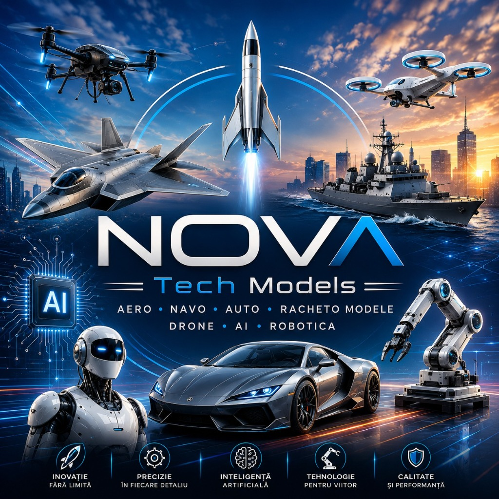

# 🚀 NOVA Tech Models 3D

> **Next-Generation Technological Modeling, Aerospace Engineering, AI Robotics & Academy**  
> 🔗 **Website Oficial:** **[https://lefterpatrickandrei-sketch.github.io/nova-tech-models/](https://lefterpatrickandrei-sketch.github.io/nova-tech-models/)**  
> 📂 **Arhivă Google Drive:** **[NOVA TECH MODELS Cloud Repository](https://drive.google.com/drive/folders/1ZC9yyabVBYV2QPtvSvIvqFAo55iqdNjM)**  
> ✉️ **Contact Email:** `contact@novatechmodels.ro`

---

### 🌐 [👉 Deschide Platforma Completă NOVA Tech & Academy Live](https://lefterpatrickandrei-sketch.github.io/nova-tech-models/) | [📂 Deschide Google Drive Oficial](https://drive.google.com/drive/folders/1ZC9yyabVBYV2QPtvSvIvqFAo55iqdNjM)

---

---

## 🌟 Prezentare Generală

**NOVA Tech Models** este o platformă web de prezentare și configurare pentru modele inginerești și tehnologice avansate:
- 🚀 **Aero**: Aviație supersonică stealth Mach-4 cu geometrie variabilă.
- ⚓ **Navo**: Crucișătoare stealth navale cu corp din compozit kevlar.
- 🏎️ **Auto**: Hypercar-uri aerodinamice V12 din fibră de carbon forjată.
- 🌌 **Rachetomodele**: Rachete orbitale treapta 2 cu telemetrie digitală și recuperare automată.
- 🛸 **Drone**: Hexacoptere autonome cu navigație LiDAR și AI visual copilot.
- 🦾 **Robotică & AI**: Brațe robotice industriale pe 6 axe și roboți umanoizi.

---

## 💎 Caracteristici Tehnice & Design System

- **Piloni Fundamentali**: Inovație fără limită, Precizie în fiecare detaliu, Inteligență artificială, Tehnologie pentru viitor, Calitate și performanță.
- **Bento Grid Modular**: Catalog interactiv cu filtrare dinamică în timp real.
- **Configurator 3D Interactiv**: Calculator de preț și randare dinamică a specificațiilor în funcție de scală, materiale (Carbon 3K, Titan Aerospațial Grad 5) și pachete AI.
- **Comutator Temă**: Dark Cyberpunk Luxury / High-Tech Titanium Light.
- **Calitate & A11y**: 100/100 Scor Audit (WCAG 2.2 AAA, HTML5 Semantic, zero CLS).

---

## 🛠️ Tehnologii Utilizate

- **HTML5 Semantic & Schema.org JSON-LD**
- **Modern CSS (OKLCH Color Tokens, Container Queries, Glassmorphism, 8pt Grid)**
- **Vanilla JavaScript (Spring Physics, Spotlight Cursor Tracking, State Management)**

---

## 📄 Licență & Drepturi

© 2026 NOVA Tech Models. Toate drepturile rezervate.
